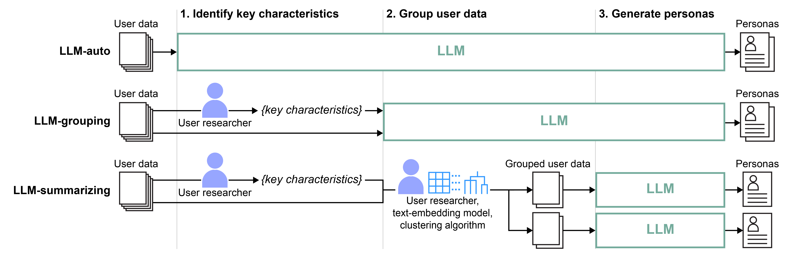
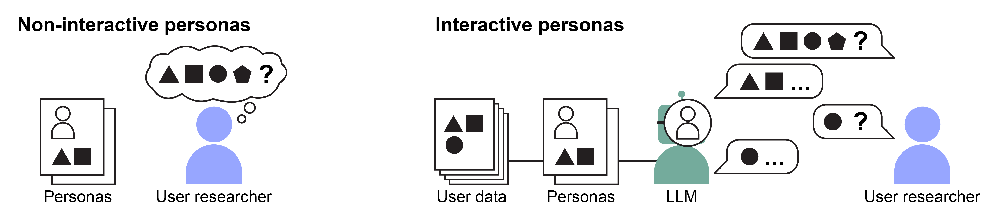

# Understanding Human–AI Workflows for Generating Personas



<ul style="margin-bottom: 20px;">
  <li style="margin-bottom: 10px;">This project shows that LLMs can help generate representative and empathy-evoking personas from user data, in a human-AI workflow.</li>
  <li style="margin-bottom: 10px;">With this repository, you can try out four persona-generation workflows that differently delegate subtasks between human experts (e.g., user researchers and designers) and LLMs as shown in the figure above.</li>
  <ul>
    <li style="margin-bottom: 10px;"><i>LLM-auto</i>: Mostly relies on LLMs to generate personas.</li>
    <li style="margin-bottom: 10px;"><i>LLM-grouping</i>: Relies on humans to identify the key characteristics for grouping user data. Accordingly, LLMs create user groups and generate personas.</li>
    <li style="margin-bottom: 10px;"><i>LLM-summarizing</i>: Mostly relies on human. LLMs' only task is summarizing each grouped user data into a persona.</li> 
    <li style="margin-bottom: 10px;"><i>LLM-summarizing++</i>: A version of LLM-summarizing with designers' preferred qualities of personas specified in the prompt, which are being more expressive, recalling previous contents as motivations, and emphasizing the most important characteristics instead of listing all. (llm_summarizing_v2 in our code).</li>
  </ul>
  <li style="margin-bottom: 10px;">In our study, <i>LLM-summarizing++</i> resulted in the most representative and empathy-evoking personas compared to other workflows and designers working alone.</li> 
  <li style="margin-bottom: 10px;">The project is published at DIS'24 <a href="https://doi.org/10.1145/3643834.3660729">(paper)</a> <a href="https://joongishin.github.io/perGenWorkflow/">(project page)</a></li>
</ul>

<br>

## Setup
You need OpenAI API key to try out our workflow. Follow [Developer quickstart](https://platform.openai.com/docs/quickstart) from OpenAI.

1. Download our repository.
2. Install the OpenAI library.
```
pip install openai
```
3. Open [settings.py](./settings.py) to input your OpenAI API key and set the models available to you. For example...
```
openai_api_key = "your-OpenAI-API-Key"
gpt_model = "gpt-4"
embedding_model = "text-embedding-ada-002"
```
4. All set. Follow the usage below to try our workflows.

<br>

## Usage
We provide [synthetic user data](./data/synthetic_surveys.csv) generated with gpt-3.5-turbo for trying out our workflows. It is 20 responses to a survey aimed at collecting user data for designing civis services that address declining birth rates.
Accordingly, the contents of personas are set in [settings.py](./settings.py). They will be used in a prompt to instruct LLMs what to describe in personas.
```
file_name = "synthetic_survey.csv"
content_demography = ["Name:", "Age:", "Gender:", "Occupation:", "Marital Status:"]
content_design = ["Background:", "Personality:", "Plans for having children:", "Motivation for using civic services:"]
```
Example input and resulting personas in each [llm_auto](./llm_auto), [llm_grouping](./llm_grouping), [llm_summarizing](./llm_summarizing), and [llm_summarizing_v2](llm_summarizing_v2) folder.

If you wish to use your own user data, put it in the [data](./data) folder, change the 'file_name' in [settings.py](./settings.py) to your data file, and change the contents of personas accordingly.

<br>

### LLM-auto
You do not need to make any further changes. 
1. Run [llm_auto.py](./llm_auto.py).
2. Personas are stored in the [llm_auto](./llm_auto) folder.

<br>

### LLM-grouping
You, as a user researcher, need to set the 'key characteristics' for LLMs.
1. Review the [user data](./data/synthetic_surveys.csv) and identify users' key characteristics for defining archetypal user groups. One way of thinking is imagining what kinds of information that personas should highlight to help you understand your users or design solutions for them.
2. Set the key characteristics in [llm_grouping.py](./llm_grouping.py). For example, ...
```
key_characteristics = "plans and reasons for having children"
```
3. Run [llm_grouping.py](./llm_grouping.py).
4. Personas are stored in the [llm_grouping](./llm_grouping) folder.

<br>

### LLM-summarizing and LLM-summarizing++
As a user researcher, you need to pre-group user data for LLMs to generate one persona per group. For this, you can explore alternate ways of grouping users with help of supplementary algorithms.
1. Similar to LLM-grouping, review the [user data](./data/synthetic_surveys.csv).
2. From the user data, identify which user responses (here, by the columns) contains the most important information for defining archetypal user groups.
3. Explore different ways of grouping users with [explore_user_groups.py](./explore_user_groups.py). For this, set the name of columns in user data and the number of user groups in the code.
```
key_data = ["child_expect", "child_need"]
num_group = 3
```
4. Run [explore_user_groups.py](./explore_user_groups.py).
5. The summary of each group of user data is stored in the [exploration](./llm_summarizing/exploration) folder.
6. Repeat 1-5 until you are satisfied with the user groups.
7. Run [llm_summarizing.py](./llm_summarizing.py) or [llm_summarizing_v2.py](./llm_summarizing_v2.py)
8. Personas are stored in the [llm_summarizing](./llm_summarizing) or [llm_summarizing_v2](./llm_summarizing_v2) folder, respectively.

<br>

### Roleplay with Personas



In this project, we also explored the potential of LLMs 'role-playing' generated personas. Here, LLMs respond to your questions by acting as the generated personas and considering previous conversations. For this, the personas in the [llm_summarizing](./llm_summarizing) folder are used.

1. In [roleplay.py](./roleplay.py), set the maximum number of the latest dialogues for LLMs to consider when generating responses (it is set to 3 as default).
```
max_number_of_memory = 3
```
2. Run [roleplay.py](./roleplay.py)
3. [Conversation log](./llm_summarizing/roleplay/roleplay.csv) is stored when you end the interaction.

<br>

## Bibtext
```bibtex
 @inproceedings{shin:2024:perGenWorkflow,
    title={Understanding Human–AI Workflows for Generating Personas},
    author = {shin, Joongi and Hedderich, Michael A. and Rey, Bartłomiej Jakub and Lucero, Andrés and Oulasvirta, Antti},
    publisher = {Association for computing Machinery},
    booktitle = {Proceedings of the 2024 ACM Designing Interactive Systems Conference},
    year={2024},
    url={https://doi.org/10.1145/3643834.3660729},
    doi={10.1145/3643834.3660729}
 ```